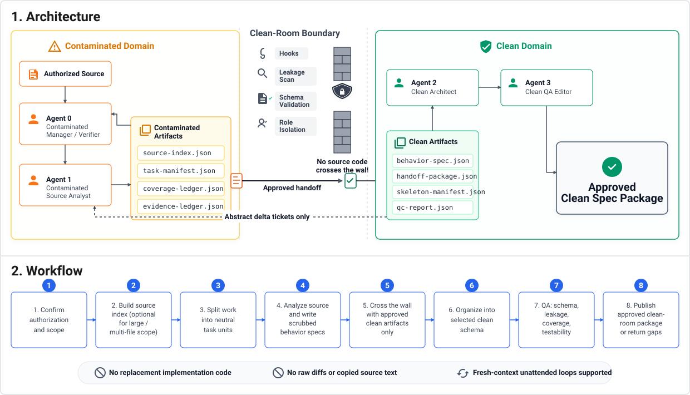

# Clean Room

Clean Room is an agent workflow for turning authorized source analysis into clean behavioral specs, clean implementation plans, and clean destination code.

It is a POC based on ideas from [malus.sh](https://malus.sh/blog.html). It is an engineering risk-reduction workflow, not legal advice, and it does not create a legal safe harbor.

## What This Is / Does

Use this package when you need documented separation between source-reading work and clean implementation work.

It installs:

- Clean-room skills for Codex, Claude Code, and other agent runtime layouts.
- Role-agent prompts for contaminated analysis, clean planning, clean implementation, and final polish.
- JSON schemas and examples for durable workflow artifacts.
- Hook guardrails that help keep source material out of clean artifacts.
- A small CLI for runtime installation, bootstrap folders, preflight contracts, hook smoke tests, and the bounded inner clean-room runner.

The workflow creates clean behavioral spec packages and clean implementation outputs. It does not generate replacement code directly from source.

Core boundary:

- Contaminated roles may read authorized source and write contaminated artifacts.
- Source-denied roles may read only clean artifacts, implementation roots, schemas, and approved public/reference roots.
- Clean implementation code is written only under the clean implementation root.
- Raw source, source paths, private identifiers, raw diffs, copied comments, and source-shaped pseudocode must not cross into clean handoff artifacts.

For the full boundary model, see [docs/ARCHITECTURE.md](docs/ARCHITECTURE.md). For CLI and troubleshooting details, see [docs/REFERENCE.md](docs/REFERENCE.md).

## How To Install

Requires Node.js `>=22`.

Preferred interactive install:

```bash
npx clean-room-skill@latest
```

Non-interactive installs:

```bash
npx clean-room-skill@latest --codex --global --yes
npx clean-room-skill@latest --claude --global --yes
npx clean-room-skill@latest --all --global --yes
```

For edge cases such as ccsilo variants or modified Claude directories, add `--config-dir <path-to-claude-config-root>` to target that Claude config root explicitly. If Claude is launched through a wrapper, set `CLEAN_ROOM_CLAUDE_EXECUTABLE=/absolute/path/to/wrapper`; the installer runs that exact executable and rejects relative, cwd-local, and `node_modules/.bin` paths.

Claude global installs use Claude's plugin system for skills and agents, so entry points are namespaced as `/clean-room:init`, `/clean-room:preflight`, and `/clean-room`. The installer still manages hook files and migrates older standalone Claude skill copies out of the config root on reinstall or update.

Hook modes:

- `--hooks=safe`: default. Hooks are installed but enforce only during clean-room role sessions with the required environment.
- `--hooks=strict`: fail-closed hook mode for dedicated Codex or Claude clean-room homes.
- `--hooks=copy-only` or `--no-hooks`: copy hook files without registering runtime hook config.

Verified runtimes are Codex and Claude Code. Other runtime layouts are installed on a best-effort basis. See [docs/REFERENCE.md](docs/REFERENCE.md#runtime-support) for the full support table and install roots.

Marketplace install is also supported.

Codex:

```bash
codex plugin marketplace add https://github.com/whit3rabbit/clean-room-skill.git
```

Claude Code:

```text
/plugin marketplace add https://github.com/whit3rabbit/clean-room-skill.git
/plugin install clean-room@clean-room-skill
```

## How To Run

Optionally create neutral external run folders and a clean-safe repository stub:

```bash
npx clean-room-skill@latest init
```

The default task root is `~/Documents/CleanRoom/<task-id>/` with `contaminated/`, `clean/`, `implementation/`, and `quarantine/` children. Keep active contaminated artifacts, clean artifacts, and clean implementation roots separate.

In Claude Code, invoke skills with the plugin namespace:

```text
/clean-room:init
/clean-room:preflight
/clean-room
/clean-room:attended
/clean-room:unattended
/clean-room:resume
/clean-room:start-over
/clean-room:refocus
```

In Codex, invoke the `clean-room` plugin or bundled skills through `@` or the skills UI. Do not rely on Claude-style slash namespacing in Codex.

For unattended inner-loop execution from durable artifacts:

```bash
npx clean-room-skill@latest run \
  --task-manifest ~/Documents/CleanRoom/task-1234abcd/contaminated/task-manifest.json \
  --agent-commands ./agent-commands.json \
  --max-iterations 3
```

The `run` command executes one bounded inner clean-room loop for an already approved spec slice. It does not replace the outer spec-development workflow.

In strict context-management mode, every `agent-commands.json` stage must set `context.fresh_session: true` and `context.brief_path`; see the runner adapter example in `docs/REFERENCE.md`.

## Typical Workflow



1. Initialize or bootstrap the run.
   Use `npx clean-room-skill@latest init` to create neutral external run folders and a clean-safe repository stub, or use `/clean-room:init` for skill-driven run preferences. The active `init-config.json` stays out of the clean implementation repository.

2. Record the goal contract.
   Use `npx clean-room-skill@latest preflight` or `/clean-room:preflight` before source discovery, attended mode, or unattended mode. This creates or validates `preflight-goal.json` on the contaminated/controller side.

3. Start the controller.
   Use `/clean-room` or `/clean-room:attended` for human review gates. Use `/clean-room:unattended` only after preflight allows bounded unattended work with finite iteration limits and no open questions.

4. Analyze and sanitize.
   Source-reading roles produce neutral draft behavior specs. A source-denied sanitizer reviews handoff candidates before anything enters the clean domain.

5. Plan, implement, and polish.
   Clean roles read only approved clean artifacts and the clean destination foundation. Agent 2 writes `implementation-plan.json`; Agent 3 writes code/tests under the implementation root and reports under clean artifacts. Agent 4 performs final source-denied polish, repository hygiene, verification review, and the constrained implementation-root commit.

6. Verify and return.
   Agent 0 performs contaminated-side coverage verification after Agent 3 reaches a terminal state and any configured Agent 4 polish review passes, then writes `clean-room-result.json`.

Use recovery skills instead of chat history:

- `/clean-room:resume`: continue from durable artifacts.
- `/clean-room:start-over`: archive or quarantine current artifacts without deletion, then restart with a fresh neutral task id.
- `/clean-room:refocus`: audit current artifacts against declared scope without expanding scope.

## Workflow Entry Points

| Order | Entry point | Type | Use it for |
| --- | --- | --- | --- |
| 1 | `npx clean-room-skill@latest init` | CLI command | Create neutral external run folders and a clean-safe `.clean-room/README.md` stub. |
| 1 | `/clean-room:init` | Skill | Record run preferences, separated roots, schema profile, and model policy. |
| 2 | `npx clean-room-skill@latest preflight` | CLI command | Create or validate the Stage 0 goal contract. |
| 2 | `/clean-room:preflight` | Skill | Record the required goal, policy, output, and controller-mode contract. |
| 3 | `/clean-room` | Skill | Start the setup wizard for authorized clean-room work. |
| 3 | `/clean-room:attended` | Skill | Start the wizard in attended mode with human review gates. |
| 3 | `/clean-room:unattended` | Skill | Start the wizard in bounded unattended mode with finite loop limits. |
| 4 | `npx clean-room-skill@latest run` | CLI command | Execute the bounded inner clean-room runner for one approved spec slice. |

### Maintenance CLI Commands

| Command | Use it for |
| --- | --- |
| `npx clean-room-skill@latest doctor` | Smoke test generated Codex or Claude hook registration. |
| `npx clean-room-skill@latest status` | Report installed runtime version, drift, and hook state. |
| `npx clean-room-skill@latest update` | Refresh installed runtime files without onboarding. |

### Recovery Skills

| Skill | Use it for |
| --- | --- |
| `/clean-room:resume` | Continue an existing run from durable artifacts. |
| `/clean-room:start-over` | Non-destructively archive or quarantine current artifacts and restart. |
| `/clean-room:refocus` | Audit a run and route it back to missed gates without adding scope. |

Reference files:

- [docs/REFERENCE.md](docs/REFERENCE.md): CLI flags, hook modes, troubleshooting, and local verification.
- [docs/ARCHITECTURE.md](docs/ARCHITECTURE.md): operating model, roles, environment, guardrails, and flow details.
- [docs/HOOKS.md](docs/HOOKS.md): hook install locations, generated matchers, and per-hook behavior.
- [skills/clean-room/references/PROCESS.md](skills/clean-room/references/PROCESS.md): detailed clean-room process.
- [skills/clean-room/references/LEAKAGE-RULES.md](skills/clean-room/references/LEAKAGE-RULES.md): clean handoff rules.

## Development

Install dependencies:

```bash
npm ci --ignore-scripts
```

Run tests:

```bash
npm test
```

Run installer tests only:

```bash
npm run test:install
```

Run the full local verifier:

```bash
npm run verify
```

Documentation-only changes usually need review plus link/path checks, not the full test suite.

Useful development checks:

```bash
node --check bin/install.js
node --test tests/run.test.js
npm pack --dry-run
```

Python schema validation requires `jsonschema` with format extras:

```bash
python3 -m venv .venv
.venv/bin/python -m pip install "jsonschema[format]>=4.18,<5"
.venv/bin/python tests/validate_jsonschema.py
```

Use `st` for repository search.
