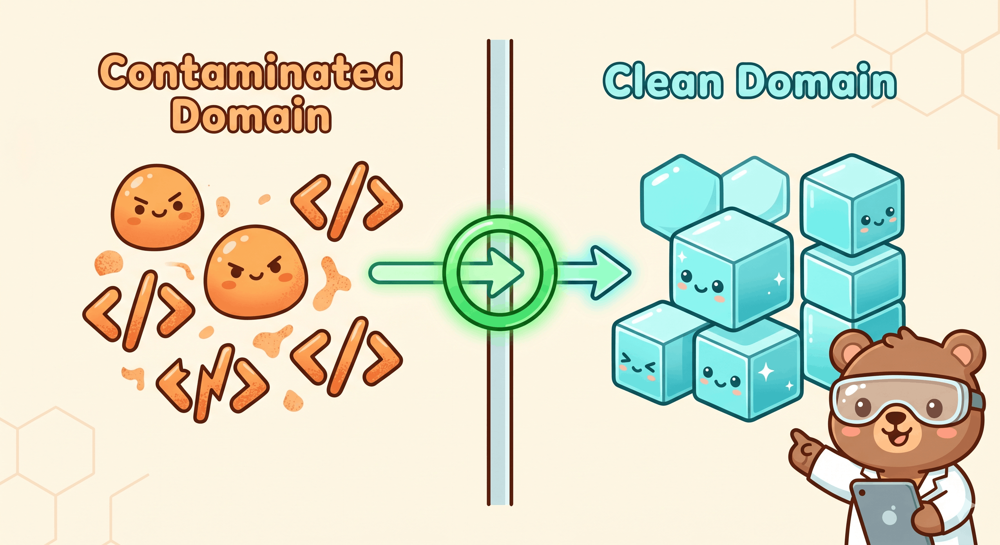
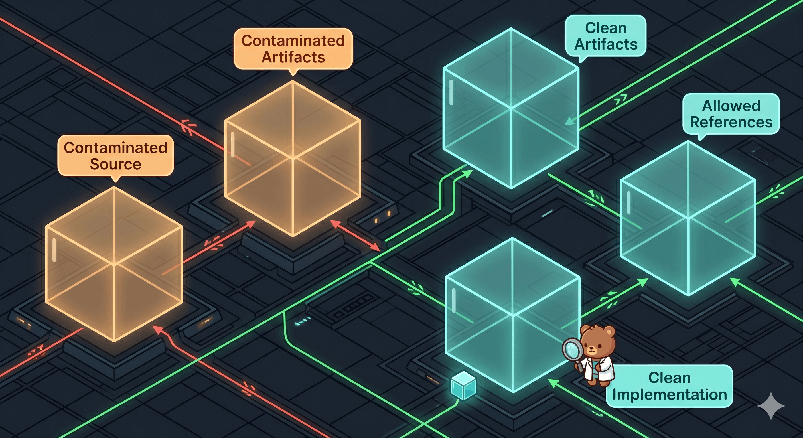
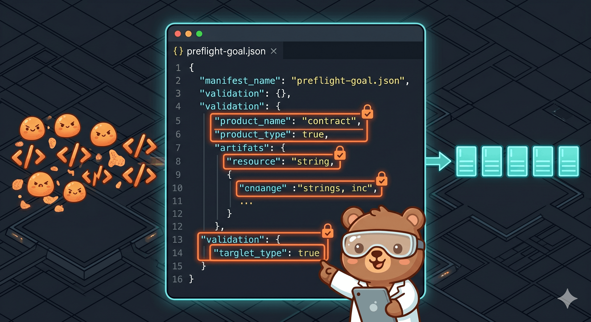
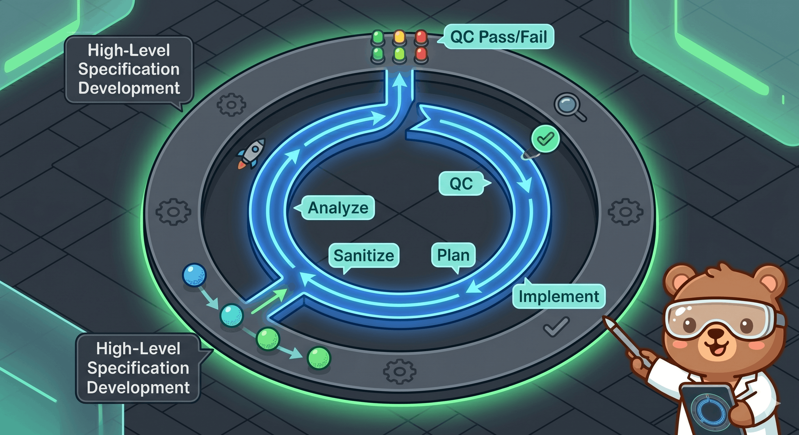

# Clean Room Architecture

This document provides a comprehensive technical overview of the Clean Room workflow for clean specs and clean implementation. The architecture enforces separation of concerns between contaminated source analysis, clean planning, and clean code development.

---

## High-Level Overview

The Clean Room workflow acts as an engineering risk-reduction process by establishing a unidirectional boundary (the "clean-room wall"). It isolates agents with access to source code from agents responsible for producing clean behavioral specifications, implementation plans, and clean destination code.


---

## Operating Model



To maintain compliance and mitigate leakage risks, the workflow utilizes strictly separated workspaces, worktrees, repositories, or profiles for contaminated and clean work:

*   **Contaminated Source Workspace**: Source-readable, read-only where practical. Contains the codebase under analysis.
*   **Contaminated Artifact Workspace**: Holds intermediate outputs like preflight goals, init configs, source indexes, visual indexes, task manifests, controller status, coverage ledgers, evidence ledgers, draft specs, contaminated-role session briefs, and abstract delta tickets. Configure via `CLEAN_ROOM_CONTAMINATED_ARTIFACT_ROOTS`.
*   **Clean Artifact Workspace**: Houses sanitized clean run contexts, approved behavioral specifications, handoff packages, clean-role session briefs, skeleton manifests, implementation plans, implementation reports, QC reports, and test plans. Configure via `CLEAN_ROOM_CLEAN_ROOTS`.
*   **Clean Implementation Workspace**: Houses clean destination code and tests. Configure via `CLEAN_ROOM_IMPLEMENTATION_ROOTS`.
*   **Clean Allowed Reference Workspace**: Public documentation, specifications, or destination constraints explicitly approved for clean and source-denied role reads. Configure via `CLEAN_ROOM_ALLOWED_READ_ROOTS`.

> [!IMPORTANT]
> Prompt instructions alone do not form a boundary. The system enforces safety using OS-level path separation, role-specific sessions, agent/tool hook checks, JSON schema validation, and strict artifact quarantine.

Optional Docker or Podman support is limited to Agent 3 verification containers. These containers are selected by execution policy and per-command metadata, run argv-array commands through the installed verification runner, and never mount source roots or contaminated artifact roots. The first supported profiles are `node22`, `python312`, `go126`, and `rust-stable`.

### Path Naming Guards

Artifact roots must not disclose private source names. New runs default to `~/Documents/CleanRoom/<task-id>/`; when no explicitly approved neutral task ID is provided, the controller generates `task-` plus 8 lowercase hex characters instead of using the source folder name.

Multiple tasks targeting the same destination may be grouped under an optional clean-room project: `~/Documents/CleanRoom/<project>/tasks/<task-id>/` with one shared `<project>/implementation/` root. Project names follow the same neutrality rule as task IDs: a random neutral word pair (such as `amber-meadow`) or a generated `proj-` plus 8 lowercase hex characters, matching `[a-z0-9][a-z0-9-]{0,63}` and never derived from source folder names. Because the implementation root is shared, run at most one active task per project at a time; `clean-room-skill run` enforces this with an advisory `.clean-room-implementation.lock` in each implementation root.



The initialization wizard and `require-clean-room-env.py` audit clean, implementation, and contaminated artifact root names. They fail closed when a path contains a source root basename or meaningful non-generic tokens from that basename, while filtering generic terms such as `src`, `app`, `test`, `repo`, and `workspace`.

### Stage 0 Goal Contract



Every new run starts with `preflight-goal.json` before source discovery, source indexing, visual indexing, Agent 0 decomposition, attended execution, or unattended execution. The contract records end goal, target stack, license policy, dependency policy, compatibility exactness, feature changes, code hygiene, output policy, controller mode, and open questions.

`preflight-goal.json` is controller/contaminated-side only. Clean roles receive only clean-safe `goal_contract` fields and `code_hygiene_policy` through `clean-run-context.json`.

### Contaminated Source-Index Preflight Tooling

To assist in logical unit decomposition, the workflow supports an optional source-index preflight stage using `build_source_index.py` and `clean_room_tool_manager.py`. When no indexable source code exists and screenshots/images are the authorized evidence, the workflow supports a fallback visual-index preflight stage using `build_visual_index.py`.

*   **Execution Boundary**: This tooling runs exclusively in the contaminated domain before clean-room role sessions are initialized.
*   **Traversal Bounds**: Source indexing enforces file count, per-file byte, total byte, batch token, and segment caps. It validates file size again after reading, skips files that change during read, records directory walk errors, and prunes traversal after global limits are exhausted with an aggregate skipped entry.
*   **Agent 0 Use**: Agent 0 consumes `source-index.json` only to create neutral `task-manifest.json` units and per-unit `source_index_refs`. In visual fallback runs, Agent 0 consumes `visual-index.json` only to create neutral units and per-unit `visual_index_refs`. Both indexes stay contaminated-only and do not cross to Agent 1.5, Agent 2, Agent 3, Agent 4, or clean handoff packages.
*   **Discovery Leads**: When Agent 1 detects an authorized related surface that cannot be analyzed inside the assigned unit, Agent 0 tracks it in contaminated `coverage-ledger.json` `discovery_leads`. High-priority leads must be resolved before the unit can be marked covered; the runner does not expand approved scope automatically.
*   **Tool Trust Policy**: By default, tool discovery operates in `stat-only` mode and does not execute third-party binaries. It queries version strings only when explicitly invoked with `--probe-tools`. Tools discovered under `/opt/homebrew` or `/usr/local` remain stat-only unless `--allow-user-toolchain-probes` is also supplied. Project-local directories (such as `.bin` or `node_modules/.bin`) are ignored unless the environment variable `RE_SKILLS_TRUST_PROJECT_TOOLS=1` or the flag `--allow-working-project-tools` is supplied.
*   **Local Tool Install Safety**: Explicit npm-backed helper installs are strict-version pinned and serialized with a cache-local lock before mutating `~/.cache/re-skills/clean-room-tools/npm`. Prefix creation failures, subprocess timeouts, and subprocess launch errors are returned as structured JSON facts instead of raw tracebacks.

### Installer State Safety

Runtime installs and uninstalls serialize per target root with `.clean-room-install.lock`. The installer plans desired file changes from manifest hashes, then rechecks each managed file immediately before write or removal. Managed files that changed after planning are backed up before mutation.

The manifest is written with `phase: "installing"` after file copy and before hook config mutation. It is updated to `phase: "complete"` only after hook config succeeds. If hook config mutation fails, the installer records `hook_registration.status: "failed"` in the manifest when possible. A manifest left in `installing` is recoverable by re-running the same installer command. Bootstrap writes use atomic no-clobber creation unless `--force` is set.

---

## Separation & Flow Diagrams

### Flowchart Representation

The following diagram illustrates how the agents, workspace roots, and guardrails interact across the Clean-Room Wall:

```mermaid
flowchart LR
  subgraph contaminated["Contaminated domain"]
    source["Authorized source roots<br/>CLEAN_ROOM_SOURCE_ROOTS"]
    manager["Agent 0: contaminated-manager-verifier<br/>Scope, decompose, track coverage, verify"]
    analyst["Agent 1: contaminated-source-analyst<br/>Read source, write draft specs"]
    sanitizer["Agent 1.5: contaminated-handoff-sanitizer<br/>Source-denied, scrub identifying material"]
    brief["Neutral sanitizer brief<br/>domain, target profile, unit intent,<br/>public allowlist, blocked categories"]
    preflight["preflight-goal.json<br/>goal, stack, policy, hygiene"]
    ledgers["Contaminated artifacts<br/>CLEAN_ROOM_CONTAMINATED_ARTIFACT_ROOTS<br/>init-config.json<br/>source-index.json<br/>visual-index.json<br/>task-manifest.json<br/>coverage-ledger.json<br/>evidence-ledger.json"]
    drafts["Agent 1 draft specs<br/>assigned paths only for Agent 1.5"]
    staged["Sanitized handoff candidates<br/>Agent 1.5-reviewed behavior-spec.json"]
  end

  subgraph wall["Clean-room wall"]
    handoff["Approved handoff only<br/>clean-run-context.json with clean-safe goal_contract<br/>handoff-package.json<br/>Agent 1.5-passed behavior-spec.json"]
    blocked["Blocked from crossing<br/>source excerpts, raw diffs, copied comments,<br/>private identifiers, source-shaped pseudocode"]
  end

  subgraph clean["Clean domain: source-denied"]
    cleanroots["Clean artifact roots<br/>CLEAN_ROOM_CLEAN_ROOTS"]
    implroots["Clean implementation roots<br/>CLEAN_ROOM_IMPLEMENTATION_ROOTS"]
    publicrefs["Allowed public refs<br/>CLEAN_ROOM_ALLOWED_READ_ROOTS"]
    architect["Agent 2: clean-architect<br/>Plan implementation from clean specs and foundation"]
    qa["Agent 3: clean-qa-editor<br/>Implement, record verification, terminal report"]
    polish["Agent 4: clean-polish-reviewer<br/>Final code polish, repo hygiene, local commit"]
    outputs["Clean artifacts<br/>implementation-plan.json<br/>implementation-report.json<br/>qc-report.json<br/>polish-report.json<br/>test plan notes"]
    imploutputs["Implementation outputs<br/>code, tests, fixtures, AGENTS.md, .gitignore"]
  end

  subgraph guardrails["Guardrails and audit"]
    env["require-clean-room-env.py"]
    denyread["deny-clean-source-read.py"]
    denywrite["deny-contaminated-clean-write.py<br/>write root policy"]
    denyshell["deny-clean-room-shell.py"]
    scan["check-artifact-leakage.py<br/>validate-json-schema.py"]
  end

  preflight --> manager
  source --> manager
  manager --> analyst
  manager --> brief
  manager --> ledgers
  analyst --> ledgers
  analyst --> drafts
  brief --> sanitizer
  drafts --> sanitizer
  sanitizer --> staged
  sanitizer --> ledgers
  staged --> handoff
  handoff --> cleanroots
  cleanroots --> architect
  implroots --> architect
  publicrefs --> architect
  architect --> outputs
  architect --> imploutputs
  outputs --> qa
  implroots --> qa
  qa --> imploutputs
  qa --> outputs
  imploutputs --> polish
  outputs --> polish
  polish --> imploutputs
  polish -. terminal polish report only<br/>abstract delta tickets .-> manager
  qa -. terminal report only<br/>abstract delta tickets .-> manager

  blocked -. quarantine do not hand off .-> ledgers
  env -. required for every role session .-> manager
  env -. required for every role session .-> architect
  denyread -. clean and source-denied roles cannot read source roots .-> cleanroots
  denyread -. clean roles may read implementation roots .-> implroots
  denyread -. Agent 1.5 cannot read source/visual roots, clean roots, implementation roots, source-index.json, visual-index.json, or preflight-goal.json .-> sanitizer
  denywrite -. contaminated writes only to contaminated artifact roots .-> ledgers
  denywrite -. Agent 2 writes clean artifacts; Agents 3 and 4 write clean reports .-> cleanroots
  denywrite -. Agents 3 and 4 write destination files only here; no clean-room artifact JSON .-> implroots
  denyshell -. no shell-style tools in role sessions .-> manager
  denyshell -. no shell for Agent 2; explicit Agent 3 and Agent 4 runners only .-> architect
  scan -. post-write checks .-> outputs
  scan -. Agent 1.5 staged-output checks .-> staged

  classDef contaminatedDomain fill:#fff7ed,stroke:#c2410c,color:#111827;
  classDef cleanDomain fill:#ecfeff,stroke:#0e7490,color:#111827;
  classDef wallClass fill:#f8fafc,stroke:#475569,color:#111827;
  classDef guardClass fill:#f0fdf4,stroke:#15803d,color:#111827;
  class source,preflight,manager,analyst,sanitizer,brief,ledgers,drafts,staged contaminatedDomain;
  class cleanroots,implroots,publicrefs,architect,qa,polish,outputs,imploutputs cleanDomain;
  class handoff,blocked wallClass;
  class env,denyread,denywrite,denyshell,scan guardClass;
```

---

## Agent Roles

The architecture delegates work across six distinct custom role agents to enforce separation between source reading, independent sanitization, clean planning, clean implementation, and final clean polish review.

### [Agent 0: Contaminated Manager Verifier](../agents/contaminated-manager-verifier.md)
*   **Domain**: Contaminated (Source-readable)
*   **Write Target**: Contaminated artifact workspace (`CLEAN_ROOM_CONTAMINATED_ARTIFACT_ROOTS`)
*   **Responsibilities**:
    *   Validates authorization bounds, scope, and prohibited actions in `task-manifest.json`.
    *   Requires a validated `preflight-goal.json` and records `preflight_goal_ref`, `preflight_goal_sha256`, and `handoff_sequence`.
    *   Decomposes source scope into stable, neutral units that do not mirror private source layout.
    *   Controls execution flow and nested loop state.
    *   Provides Agent 1.5 only a neutral sanitizer brief containing domain purpose, target profile, unit intent, public compatibility allowlist, and blocked categories.
    *   Produces `clean-run-context.json` for Agent 2, Agent 3, and Agent 4 instead of handing over the full `task-manifest.json` or full `preflight-goal.json`.
    *   Influences Agent 2, Agent 3, and Agent 4 only through durable sanitized artifacts, never direct chat, progress feedback, implementation hints, or priority changes.
    *   Performs final verification of clean specification and implementation coverage against the source scope.
    *   Blocks handoff or coverage completion when high-priority contaminated discovery leads remain unresolved.
    *   Treats completion as deny-by-default unless durable canonical artifacts prove the clean behavior gate.
    *   Writes the inner-loop `clean-room-result.json` only after contaminated-side coverage verification.
    *   Consumes Agent 3 reports only after Agent 3 reaches a terminal state, and consumes Agent 4 reports only after the configured polish review reaches a terminal state, then sends only abstract delta tickets into a fresh clean artifact cycle.

### [Agent 1: Contaminated Source Analyst](../agents/contaminated-source-analyst.md)
*   **Domain**: Contaminated (Source-readable, Read-only access to source)
*   **Write Target**: Contaminated artifact workspace (`CLEAN_ROOM_CONTAMINATED_ARTIFACT_ROOTS`)
*   **Responsibilities**:
    *   Analyzes the authorized source code within assigned units or batches.
    *   Uses target stack and compatibility policy from preflight instead of inferring product goals from source.
    *   Writes neutral draft behavioral specifications based on observed behavior, public contracts, invariants, state transitions, and errors.
    *   Inventories the assigned unit's observable CLI, env, TUI, UI, protocol, config, command, and public behavior surfaces when relevant.
    *   Records authorized related surfaces that cannot be analyzed in the assigned context as contaminated `discovery_leads`, not clean spec fields.
    *   Generates evidence references pointing to contaminated ledgers instead of copying raw source code or comments.
    *   Flags suspected leakage but does not approve its own work for clean handoff.

### [Agent 1.5: Contaminated Handoff Sanitizer](../agents/contaminated-handoff-sanitizer.md)
*   **Domain**: Contaminated (Source-denied, no source or Agent 1 source-reading chat history)
*   **Read Sources**: Neutral sanitizer brief, assigned draft artifacts under `CLEAN_ROOM_CONTAMINATED_ARTIFACT_ROOTS`, schema assets, and explicit public or destination reference roots.
*   **Write Target**: Contaminated artifact workspace (`CLEAN_ROOM_CONTAMINATED_ARTIFACT_ROOTS`)
*   **Responsibilities**:
    *   Scrubs identifying information before handoff, including source paths, import/export listings, private identifiers, distinctive strings, copied comments, raw diffs, source excerpts, and source-shaped pseudocode.
    *   Preserves public compatibility names only when recorded with concrete compatibility reasons.
    *   Records `leakage_review.reviewer_role` as `contaminated-handoff-sanitizer`.
    *   Quarantines failed artifacts and returns only abstract regeneration feedback to Agent 0.

### [Agent 2: Clean Architect](../agents/clean-architect.md)
*   **Domain**: Clean (Source-denied, no access to source or contaminated chat histories)
*   **Write Target**: Clean artifact workspace (`CLEAN_ROOM_CLEAN_ROOTS`)
*   **Responsibilities**:
    *   Starts from the clean artifact workspace and reads `clean-run-context.json` for target profile, clean-safe rules, clean artifact paths, implementation root refs, and clean-side model preferences.
    *   Requires clean-safe `goal_contract` fields and `code_hygiene_policy` in `clean-run-context.json`.
    *   Accepts Agent 0 input only as schema-valid durable sanitized artifacts.
    *   Reads the clean destination foundation under `CLEAN_ROOM_IMPLEMENTATION_ROOTS`.
    *   Cannot write to `CLEAN_ROOM_IMPLEMENTATION_ROOTS`; the write hook rejects Agent 2 implementation-root writes.
    *   Merges approved handoff artifacts into the clean workspace.
    *   Writes `implementation-plan.json` with relative destination paths, tests, code hygiene policy, constraints, risks, and argv-array verification commands.
    *   Maintains `skeleton-manifest.json` as the clean destination architecture map for code-development runs, with owned path prefixes and refactor triggers.
    *   Assigns each implementation-plan target and test path to one or more architecture areas.

### [Agent 3: Clean Implementer Verifier](../agents/clean-qa-editor.md)
*   **Domain**: Clean (Source-denied)
*   **Write Target**: Clean reports in `CLEAN_ROOM_CLEAN_ROOTS`; code and tests in `CLEAN_ROOM_IMPLEMENTATION_ROOTS`
*   **Responsibilities**:
    *   Starts from the clean domain and validates `clean-run-context.json`.
    *   Reads `implementation-plan.json` and implements unblocked work items for the selected spec slice and current unit.
    *   Records code hygiene violations as `code-hygiene` findings in `qc-report.json`.
    *   Writes code, tests, fixtures, and destination project files only under `CLEAN_ROOM_IMPLEMENTATION_ROOTS`.
    *   Runs bounded verification only through the installed Agent 3 verification runner, with `CLEAN_ROOM_ALLOW_AGENT3_SHELL=1`, strict hooks, and cwd under implementation roots.
    *   Writes `CLEAN_ROOM_CLEAN_ROOTS/implementation-report.json` and maintains `CLEAN_ROOM_CLEAN_ROOTS/qc-report.json`.
    *   Does not report progress or ask Agent 0 for guidance during implementation.
    *   Emits one terminal report for Agent 0 only when the assigned spec slice is complete, blocked, or quarantined.

### [Agent 4: Clean Polish Reviewer](../agents/clean-polish-reviewer.md)
*   **Domain**: Clean (Source-denied)
*   **Write Target**: Clean polish reports in `CLEAN_ROOM_CLEAN_ROOTS`; code, docs, repo hygiene files, and local git metadata in `CLEAN_ROOM_IMPLEMENTATION_ROOTS`
*   **Responsibilities**:
    *   Reviews final clean implementation for security, docs/comments, exception handling, resource leaks, race conditions, missing tests, and repository hygiene.
    *   Creates or updates implementation-root `AGENTS.md` with gotchas and build/test/dev commands discovered from clean implementation files.
    *   Updates `.gitignore` only for real generated outputs, dependencies, caches, or build/test artifacts.
    *   Writes `CLEAN_ROOM_CLEAN_ROOTS/polish-report.json`.
    *   Uses `agent4-polish-runner.py` only with `CLEAN_ROOM_ALLOW_AGENT4_SHELL=1`, cwd under implementation roots, and strict hooks.
    *   May initialize git and create one local commit containing only paths listed in `polish-report.json` `git.include_paths`; that list must include terminal Agent 3 implementation changes plus Agent 4 polish changes. It must not push, tag, reset, clean, or delete branches.

### Nested Controller Loop



The outer loop owns spec development: scope, behavior specs, acceptance criteria, and abstract delta resolution. The inner clean-room loop owns one approved spec slice. It repeats analyze, sanitize, plan, implement, QC, optional final polish review, and contaminated-side coverage verification until it can return `spec-slice-complete`, `spec-slice-blocked`, `spec-delta-required`, `contamination-suspected`, `iteration-limit-reached`, or `no-progress-detected`.

Agent 3's terminal report is not enough to return. If configured, Agent 4 must produce a passing `polish-report.json`. Agent 0 must then consume the terminal clean reports, verify contaminated-side coverage, and write `clean-room-result.json`.

Completion is deny-by-default. `task-manifest.json`, `coverage-ledger.json`, and `clean-room-result*.json` writes that claim completion must be backed by durable canonical clean artifacts: a matching clean behavior spec, implementation plan mappings, a terminal implementation report, a passed QC report, valid evidence references, and required public-surface mappings. Synthetic or manual completion summaries are not completion evidence.

`clean-room-skill run` is the executable v1 inner-loop runner. It requires preflight refs, the required handoff sequence, unattended `controller_policy`, schema-valid `loop_context`, and either a user-supplied agent command adapter or the built-in Claude Code agent runtime. It does not automate outer spec development. The runner:

*   Locks the contaminated artifact root with `.clean-room-run.lock`.
*   Reloads durable artifacts before each iteration.
*   Selects at most one pending or gap unit inside `loop_context.approved_scope_refs`.
*   Requires exactly one `unit_kind: "foundation"` unit, named by `loop_context.foundation_unit_ref`; behavior units cannot run or complete until that foundation unit is covered.
*   Spawns configured role commands with `shell: false`, bounded output, and bounded timeout.
*   In strict context-management mode, requires each configured worker stage after `contaminated-manager-prepare` to provide `context.fresh_session: true` and `context.brief_path`, then validates the session brief before spawn.
*   Supports the optional `clean-polish-review` phase between `clean-implement-qc` and `contaminated-coverage-verify`.
*   Validates schema, leakage, and handoff integrity before advancing state.
*   Rejects `covered` coverage-ledger units that still have unresolved high-priority `discovery_leads`.
*   Rejects completion claims that lack canonical clean specs, plans, terminal reports, QC, evidence, or public-surface coverage mappings.
*   Records controller memory in contaminated-side `controller-run-ledger.json`.
*   Writes `clean-room-result.json` before returning to the outer spec loop.

Progress is durable-artifact based. `clean-room-skill run` compares semantic JSON artifact hashes that ignore volatile timestamp and artifact-hash fields, plus raw file hashes under implementation roots while ignoring generated directories such as `target/`. Chat output, timestamp-only artifact churn, Cargo build metadata, and `controller-status.json` updates alone do not count as progress.

---

## Operating Boundaries & Environment

Every clean-room role session requires a populated environment block before any tool execution:

*   `CLEAN_ROOM_ROLE`: Defines the active role (e.g. `clean-architect`).
*   `CLEAN_ROOM_SOURCE_ROOTS`: Source roots (only readable by source-reading contaminated roles, not Agent 1.5).
*   `CLEAN_ROOM_CONTAMINATED_ARTIFACT_ROOTS`: Target write directory for contaminated roles.
*   `CLEAN_ROOM_CLEAN_ROOTS`: Target write directory for clean artifacts and reports.
*   `CLEAN_ROOM_IMPLEMENTATION_ROOTS`: Target write directory for Agent 3 clean implementation code, tests, fixtures, real destination project files, plus Agent 4 implementation-root hygiene changes and local git metadata. Clean-room artifact JSON files stay out of this root.
*   `CLEAN_ROOM_ALLOWED_READ_ROOTS`: Approved reference docs or constraints readable by clean and source-denied roles.
*   `CLEAN_ROOM_SCHEMA_DIR`: Path to the directory containing JSON schema assets.

When context management is enabled, role sessions also receive `CLEAN_ROOM_SESSION_BRIEF_PATH`, `CLEAN_ROOM_ROLE_SESSION_ID`, and, in strict mode, `CLEAN_ROOM_FRESH_CONTEXT_REQUIRED=1`. The brief is the low-context launch packet: compact status, next action, allowed artifact refs with SHA-256, and forbidden inputs. `controller-status.json` stays contaminated-side and is not clean input.

Note: Even though clean and source-denied roles (such as Agent 1.5, 2, 3, and 4) are restricted from accessing contaminated or source workspaces, they must still be configured with the full environment block. The hook guardrails require these paths to validate that tool inputs do not cross-pollinate or violate boundary constraints.

---

## Guardrails and Hooks

The architecture relies on agent/tool hook scaffolding located in `hooks/` to enforce boundary rules dynamically during agent sessions. Use installer-generated Codex or Claude hook configs with absolute wrapper paths, or the generated OpenCode local plugin bridge. Static cwd-relative plugin hook declarations are not treated as an enforcement boundary. Use strict hooks for dedicated Codex, Claude, or OpenCode clean-room homes; safe hooks are compatibility-only between runs and begin enforcing when init/onboarding launches role sessions with clean-room environment variables.

Matcher coverage depends on the host runtime emitting hook events for the tool invocation. Hosts that do not emit a pre/post tool event for a file, terminal, or resource tool are not protected by adding that tool name to the generated hook config. Run `clean-room-skill doctor --runtime codex --hooks=strict --coverage` or the Claude equivalent after install.

Post-write hook failures are deny-by-default and redacted. If an artifact disappears, becomes unreadable, is replaced between `stat` and read, or a referenced handoff artifact cannot be hashed, the hook reports a controlled validation failure instead of a Python traceback. `doctor` is only an install smoke test, but its failures include spawn status, signal/error, and bounded stdout/stderr snippets to make hook command problems diagnosable.

*   [clean-room-hook.py](../hooks/clean-room-hook.py): The main safe/strict dispatch wrapper for the policy checks.
*   [agent3-verification-runner.py](../hooks/agent3-verification-runner.py): Runs Agent 3 argv-array verification commands with `shell=False`, sanitized env, bounded output, timeout, root traversal checks, and a small allowlist covering npm, pnpm, yarn, bun, and deno test commands; pytest directly or through `python -m` / `python3 -m`; `cargo test`; `go test`; and `zig build test`.
*   [agent4-polish-runner.py](../hooks/agent4-polish-runner.py): Runs Agent 4 bounded status, verification, git init, staging, and one local commit from implementation roots only, using paths and policy recorded in `polish-report.json`.
*   [require-clean-room-env.py](../hooks/require-clean-room-env.py): Fails closed if the required role and root environment variables are missing, if trust-domain roots overlap, or if clean, implementation, or contaminated artifact root names appear source-derived.
*   [deny-clean-room-shell.py](../hooks/deny-clean-room-shell.py): Denies shell-style tool execution inside clean-room role sessions except installed Agent 3 verification-runner invocations under implementation roots and installed Agent 4 polish-runner invocations under implementation roots.
*   [deny-clean-source-read.py](../hooks/deny-clean-source-read.py): Enforces that clean roles and Agent 1.5 cannot read source or visual roots or unapproved paths; clean roles may read implementation roots, and source-denied roles are denied direct `preflight-goal.json` reads. Agent 1.5 is also denied clean roots, implementation roots, and direct `source-index.json` or `visual-index.json` reads.
*   [deny-contaminated-clean-write.py](../hooks/deny-contaminated-clean-write.py): Enforces role write roots. Agent 2 writes clean artifacts only, Agent 3 writes implementation files and clean reports, Agent 4 writes clean polish reports and implementation-root polish changes, contaminated roles write only to `CLEAN_ROOM_CONTAMINATED_ARTIFACT_ROOTS`, and clean-room artifact JSON files are denied under `CLEAN_ROOM_IMPLEMENTATION_ROOTS`.
*   [check-artifact-leakage.py](../hooks/check-artifact-leakage.py): Scans clean artifacts and Agent 1.5 staged contaminated artifacts for high-risk leakage markers, source-like identifiers, and private identifier denylist terms. The private identifier denylist (loaded via `CLEAN_ROOM_PRIVATE_IDENTIFIER_DENYLIST`) is subject to hard limits to protect hook execution performance: a maximum of 1,000,000 bytes per file, 20,000 total terms, and 512 characters per individual term.
*   [validate-json-schema.py](../hooks/validate-json-schema.py): Verifies JSON syntax and structural conformance against schemas under `CLEAN_ROOM_SCHEMA_DIR`, including controller-side `preflight-goal.schema.json` and `init-config.schema.json`. Under clean roots, any unrecognized JSON files that do not conform to canonical schemas will trigger a failure unless they are explicitly registered in the path-separated `CLEAN_ROOM_AUXILIARY_JSON_ALLOWLIST` environment variable. Post-write validation also rejects completion claims in `task-manifest.json`, `coverage-ledger.json`, and `clean-room-result*.json` unless durable canonical completion artifacts prove the gate.
*   [validate-handoff-package.py](../hooks/validate-handoff-package.py): Verifies that handoff packages stay within clean roots, do not reference contaminated paths, `task-manifest.json`, `preflight-goal.json`, `source-index.json`, or `visual-index.json`, and match declared `sha256` checksums.

For detailed guidelines on the clean-room process, refer to:
*   [CONTROLLER-LOOP.md](../skills/clean-room/references/CONTROLLER-LOOP.md)
*   [PREFLIGHT.md](../skills/clean-room/references/PREFLIGHT.md)
*   [PROCESS.md](../skills/clean-room/references/PROCESS.md)
*   [LEAKAGE-RULES.md](../skills/clean-room/references/LEAKAGE-RULES.md)
*   [SPEC-SCHEMA.md](../skills/clean-room/references/SPEC-SCHEMA.md)
*   [TARGET-LANGUAGE-GUIDE.md](../skills/clean-room/references/TARGET-LANGUAGE-GUIDE.md)
