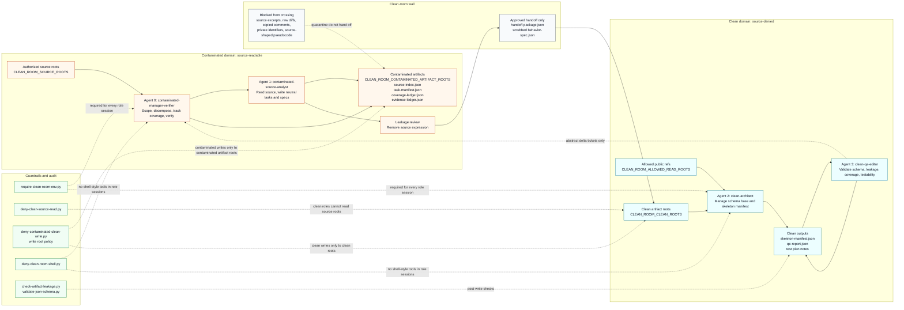

# Clean Room Architecture

This document provides a comprehensive technical overview of the spec-first Clean Room workflow. The architecture enforces separation of concerns between contaminated source analysis and clean behavioral specification.

---

## High-Level Overview

The Clean Room workflow acts as an engineering risk-reduction process by establishing a unidirectional boundary (the "clean-room wall"). It isolates agents with access to source code from agents responsible for producing clean, target-agnostic behavioral specifications.

---

## Operating Model

To maintain compliance and mitigate leakage risks, the workflow utilizes strictly separated workspaces, worktrees, repositories, or profiles for contaminated and clean work:

*   **Contaminated Source Workspace**: Source-readable, read-only where practical. Contains the codebase under analysis.
*   **Contaminated Artifact Workspace**: Holds intermediate outputs like source indexes, task manifests, coverage ledgers, evidence ledgers, draft specs, and abstract delta tickets. Configure via `CLEAN_ROOM_CONTAMINATED_ARTIFACT_ROOTS`.
*   **Clean Spec Workspace**: Houses approved behavioral specifications, handoff packages, skeleton manifests, QC reports, and test plans. Configure via `CLEAN_ROOM_CLEAN_ROOTS`.
*   **Clean Allowed Reference Workspace**: Public documentation, specifications, or destination constraints explicitly approved for clean-role reads. Configure via `CLEAN_ROOM_ALLOWED_READ_ROOTS`.

> [!IMPORTANT]
> Prompt instructions alone do not form a boundary. The system enforces safety using OS-level path separation, role-specific sessions, Git hook checks, JSON schema validation, and strict artifact quarantine.

---

## Separation & Flow Diagrams

### Flowchart Representation

The following diagram illustrates how the agents, workspace roots, and guardrails interact across the Clean-Room Wall:

---

## Agent Roles

The architecture delegates work across four distinct custom role agents to enforce separation between source reading and specification authoring.

### [Agent 0: Contaminated Manager Verifier](file:///Users/whit3rabbit/Documents/GitHub/clean-room-skill/agents/contaminated-manager-verifier.md)
*   **Domain**: Contaminated (Source-readable)
*   **Write Target**: Contaminated artifact workspace (`CLEAN_ROOM_CONTAMINATED_ARTIFACT_ROOTS`)
*   **Responsibilities**:
    *   Validates authorization bounds, scope, and prohibited actions in `task-manifest.json`.
    *   Decomposes source scope into stable, neutral units that do not mirror private source layout.
    *   Controls execution flow and iteration loop state.
    *   Performs final verification of clean specification coverage against the source scope.
    *   Sends only abstract delta tickets across the clean-room wall (no source leakage).

### [Agent 1: Contaminated Source Analyst](file:///Users/whit3rabbit/Documents/GitHub/clean-room-skill/agents/contaminated-source-analyst.md)
*   **Domain**: Contaminated (Source-readable, Read-only access to source)
*   **Write Target**: Contaminated artifact workspace (`CLEAN_ROOM_CONTAMINATED_ARTIFACT_ROOTS`)
*   **Responsibilities**:
    *   Analyzes the authorized source code within assigned units or batches.
    *   Writes neutral behavioral specifications based on observed behavior, public contracts, invariants, state transitions, and errors.
    *   Generates evidence references pointing to contaminated ledgers instead of copying raw source code or comments.
    *   Initiates leakage self-review prior to clean handoff.

### [Agent 2: Clean Architect](file:///Users/whit3rabbit/Documents/GitHub/clean-room-skill/agents/clean-architect.md)
*   **Domain**: Clean (Source-denied, no access to source or contaminated chat histories)
*   **Write Target**: Clean workspace (`CLEAN_ROOM_CLEAN_ROOTS`)
*   **Responsibilities**:
    *   Manages the selected clean specification schema base.
    *   Merges approved handoff artifacts into the clean workspace.
    *   Organizes behavioral specifications into a target-neutral `skeleton-manifest.json`.
    *   Records target-language constraints and public contract references.

### [Agent 3: Clean QA Editor](file:///Users/whit3rabbit/Documents/GitHub/clean-room-skill/agents/clean-qa-editor.md)
*   **Domain**: Clean (Source-denied)
*   **Write Target**: Clean workspace (`CLEAN_ROOM_CLEAN_ROOTS`)
*   **Responsibilities**:
    *   Validates clean specification files against the schema directory (`CLEAN_ROOM_SCHEMA_DIR`).
    *   Performs leakage reviews using guidelines in [LEAKAGE-RULES.md](file:///Users/whit3rabbit/Documents/GitHub/clean-room-skill/skills/clean-room/references/LEAKAGE-RULES.md).
    *   Drafts the final `qc-report.json`.
    *   Communicates findings and coverage gaps back to Agent 0 using abstract delta tickets only.

---

## Operating Boundaries & Environment

Every clean-room role session requires a populated environment block before any tool execution:

*   `CLEAN_ROOM_ROLE`: Defines the active role (e.g. `clean-architect`).
*   `CLEAN_ROOM_SOURCE_ROOTS`: Source roots (only readable by contaminated roles).
*   `CLEAN_ROOM_CONTAMINATED_ARTIFACT_ROOTS`: Target write directory for contaminated roles.
*   `CLEAN_ROOM_CLEAN_ROOTS`: Target write directory for clean roles.
*   `CLEAN_ROOM_ALLOWED_READ_ROOTS`: Approved reference docs or constraints readable by clean roles.
*   `CLEAN_ROOM_SCHEMA_DIR`: Path to the directory containing JSON schema assets.

---

## Guardrails and Hooks

The architecture relies on Git hook scaffolding located in `hooks/` to enforce boundary rules dynamically during agent sessions:

*   [clean-room-hook.py](file:///Users/whit3rabbit/Documents/GitHub/clean-room-skill/hooks/clean-room-hook.py): The main safe/strict dispatch wrapper for the policy checks.
*   [require-clean-room-env.py](file:///Users/whit3rabbit/Documents/GitHub/clean-room-skill/hooks/require-clean-room-env.py): Fails closed if the required role and root environment variables are missing.
*   [deny-clean-room-shell.py](file:///Users/whit3rabbit/Documents/GitHub/clean-room-skill/hooks/deny-clean-room-shell.py): Denies shell-style tool execution inside clean-room role sessions to prevent command-based read/write bypasses.
*   [deny-clean-source-read.py](file:///Users/whit3rabbit/Documents/GitHub/clean-room-skill/hooks/deny-clean-source-read.py): Enforces that clean roles cannot read source roots and unapproved paths.
*   [deny-contaminated-clean-write.py](file:///Users/whit3rabbit/Documents/GitHub/clean-room-skill/hooks/deny-contaminated-clean-write.py): Enforces role write roots (Clean roles write only to `CLEAN_ROOM_CLEAN_ROOTS`; contaminated roles write only to `CLEAN_ROOM_CONTAMINATED_ARTIFACT_ROOTS`).
*   [check-artifact-leakage.py](file:///Users/whit3rabbit/Documents/GitHub/clean-room-skill/hooks/check-artifact-leakage.py): Scans clean artifacts for high-risk leakage markers, source-like identifiers, and private identifier denylist terms.
*   [validate-json-schema.py](file:///Users/whit3rabbit/Documents/GitHub/clean-room-skill/hooks/validate-json-schema.py): Verifies JSON syntax and structural conformance against schemas under `CLEAN_ROOM_SCHEMA_DIR`.
*   [validate-handoff-package.py](file:///Users/whit3rabbit/Documents/GitHub/clean-room-skill/hooks/validate-handoff-package.py): Verifies that handoff packages stay within clean roots, do not reference contaminated paths or `source-index.json`, and match declared `sha256` checksums.

For detailed guidelines on the clean-room process, refer to:
*   [PROCESS.md](file:///Users/whit3rabbit/Documents/GitHub/clean-room-skill/skills/clean-room/references/PROCESS.md)
*   [LEAKAGE-RULES.md](file:///Users/whit3rabbit/Documents/GitHub/clean-room-skill/skills/clean-room/references/LEAKAGE-RULES.md)
*   [SPEC-SCHEMA.md](file:///Users/whit3rabbit/Documents/GitHub/clean-room-skill/skills/clean-room/references/SPEC-SCHEMA.md)
*   [TARGET-LANGUAGE-GUIDE.md](file:///Users/whit3rabbit/Documents/GitHub/clean-room-skill/skills/clean-room/references/TARGET-LANGUAGE-GUIDE.md)