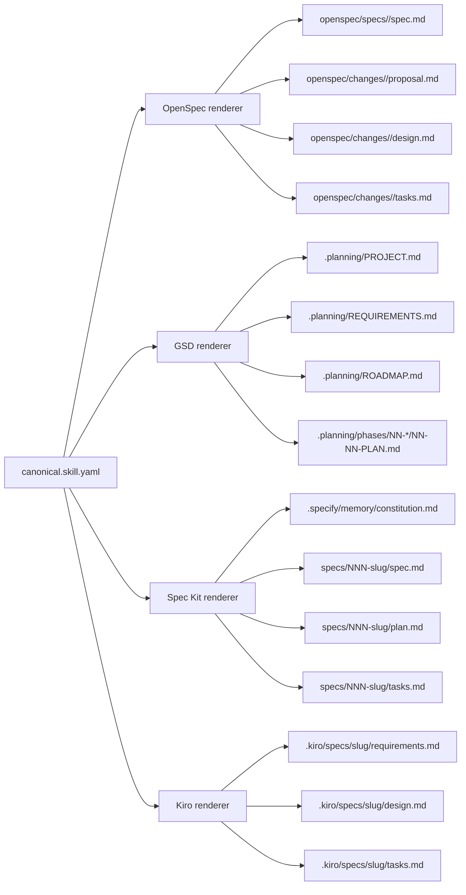
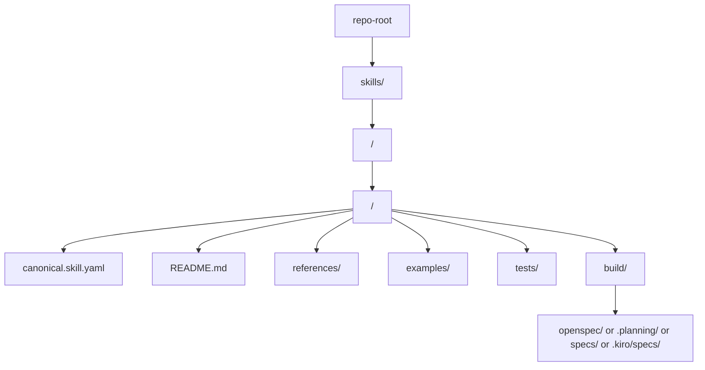
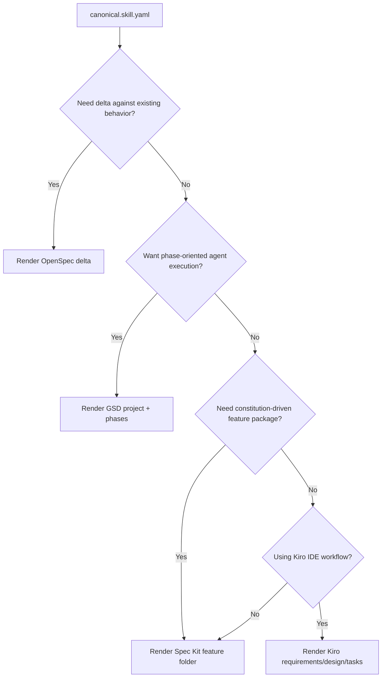

# Unified Skill Spec Compatibility Report

## Status

This is a research memo for target-format compatibility, not the clean-room artifact contract. The active clean-room contract is the schema set under `skills/clean-room/assets/` and the workflow docs under `skills/clean-room/references/`.

The citation tokens in this memo were retained from the original research session and are not repository-local links. Re-check the upstream OpenSpec, GSD, Spec Kit, and Kiro documentation before treating target-specific command names, file layouts, or CLI capabilities as current.

## Executive summary

The four systems in scope share a recognizable core, but they optimize for different planning units. OpenSpec is **change- and delta-centric**, with a persistent source-of-truth under `openspec/specs/` and proposed changes under `openspec/changes/`. GSD is **project- and phase-centric**, with a `.planning/` workspace that tracks project vision, requirements, roadmap, state, and per-phase execution artifacts. Spec Kit is **feature-branch-centric**, generating a `spec.md → plan.md → tasks.md` stack under a numbered feature folder plus a project constitution. Kiro is **feature-folder-centric**, storing `requirements.md`, `design.md`, and `tasks.md` under `.kiro/specs/<feature>/`, with workflow variants for requirements-first, design-first, quick-plan, and bugfix flows. citeturn2view0turn11view0turn14view0turn16view0turn8view0turn22view0turn25view0turn25view2turn25view1

The practical common denominator is not “one file,” but a **skill package** with six cross-format concerns: identity, governance/context, requirements, design, executable work items, and validation. OpenSpec and Spec Kit both expose strong behavioral-spec layers; Kiro’s requirements use EARS notation and can derive from design; GSD spreads equivalent information across multiple operational artifacts instead of a single feature spec. A compatibility layer should therefore treat **canonical YAML/JSON as an internal source**, then render native Markdown artifacts for each target. citeturn11view1turn5view0turn23view2turn16view0turn16view1

My highest-confidence recommendation is to adopt a **canonical schema at `skills/<domain>/<slug>/canonical.skill.yaml`**, then generate one of four native layouts on demand. This is the only approach that cleanly accommodates OpenSpec’s delta semantics, GSD’s multi-file phase orchestration, Spec Kit’s constitution plus numbered feature folder, and Kiro’s `.kiro/specs/<slug>/` triplet. citeturn2view0turn33view0turn22view0turn16view3

## Source baseline and design implications

This report prioritizes official repository docs, published templates, and original spec files. For OpenSpec, the authoritative materials were the main README, `docs/getting-started.md`, `docs/concepts.md`, `docs/commands.md`, and the project’s own `openspec-conventions/spec.md`. For GSD, the strongest sources were the README, `docs/USER-GUIDE.md`, `docs/COMMANDS.md`, and the planner agent source. For Spec Kit, the strongest sources were the README, `spec-driven.md`, raw template files, the CLI source, and the docs site. For Kiro, the strongest sources were the official docs at `kiro.dev`, the public `kirodotdev/Kiro` repository, and the repository’s own `.kiro/specs/github-issue-automation/` example files. citeturn11view2turn2view0turn11view0turn10view2turn14view0turn16view0turn20view2turn19view0turn4view0turn5view0turn8view0turn33view0turn22view0turn25view0turn27view0turn28view0turn28view1turn29view0

One important OpenSpec caveat emerged during source comparison. The user-facing docs and the later “Change Storage Convention” sections of OpenSpec’s own conventions spec clearly describe **delta files** under change folders using `## ADDED`, `## MODIFIED`, `## REMOVED`, and `## RENAMED Requirements`. However, an earlier directory-structure excerpt in the same conventions spec still describes change-folder specs as “complete future state” with “clean markdown (no diff syntax).” Because the newer README, getting-started guide, concepts doc, commands doc, and later convention sections all consistently describe delta-based storage, the safer interpretation is: **treat delta specs as the current OpenSpec rule** and treat the “complete future state” snippet as stale or transitional. citeturn12view1turn2view0turn10view0turn10view2turn38view0

Kiro also needed clarification because the user did not specify a repository. I did not find evidence that a separate public “kiro specs” repository is the primary source of truth. The strongest public sources are the official Kiro docs and the `kirodotdev/Kiro` repository, which includes a concrete example under `.kiro/specs/github-issue-automation/`. Kiro’s IDE documentation clearly documents the spec artifact format; Kiro CLI documentation exposes planning and agent capabilities, but the formal feature-spec file workflow is documented in the IDE docs, and open issues were still requesting full CLI parity for writing `.kiro/specs/...` at the time of the sources reviewed. citeturn1view6turn22view0turn27view0turn26search6turn26search2turn26search5

The design implication is straightforward: **compatibility must be package-aware, not file-aware**. OpenSpec requires a delta-aware diff renderer. GSD requires a multi-artifact splitter that can turn one feature into project-level requirements, roadmap phases, and plan files. Spec Kit needs a constitution-aware feature pack. Kiro needs a feature folder with requirements/design/tasks and optional steering context. citeturn11view1turn16view0turn16view1turn4view0turn5view1turn22view0turn22view5

## Canonical common schema

The schema below is the recommended neutral model for a cross-format skill package. It is deliberately richer than any one target format, because GSD and OpenSpec need traceability across phases or deltas, while Kiro and Spec Kit want behavior, design, and tasks in explicit generated artifacts.

```yaml
schema_version: "1.0"
package:
  id: "security.webhook-validator"
  name: "Webhook Signature Validator"
  slug: "webhook-signature-validator"
  domain: "security"
  kind: "feature"          # feature | bugfix | capability | workflow
  summary: "Validate signed webhooks with HMAC, replay protection, and timing-safe comparison."
  status: "draft"
  owners: ["platform-team"]
  tags: ["security", "api", "middleware"]

governance:
  principles:
    - "Prefer behavior-first requirements."
    - "Record all design constraints explicitly."
    - "Every task must have a verification step."
  steering_refs:
    - "product"
    - "tech"
    - "structure"
  constitution_refs:
    - "code-quality"
    - "testing"
    - "performance"

context:
  problem: "Need secure inbound webhook validation."
  goals:
    - "Reject tampered requests"
    - "Prevent replay attacks"
  constraints:
    - "Use built-in crypto where possible"
    - "p95 validation latency under 10ms"
  assumptions:
    - "Shared secret available from env"
  non_goals:
    - "No vendor-specific SDK lock-in"

requirements:
  - id: "REQ-001"
    title: "Validate HMAC signature"
    priority: "P1"
    statement: "The system SHALL validate request signatures using HMAC-SHA256."
    user_story:
      as_a: "backend developer"
      i_want: "signed webhook validation"
      so_that: "tampered requests are rejected"
    acceptance:
      - id: "AC-001"
        given: "a valid signed request"
        when: "the signature matches the canonical payload"
        then: "the request is accepted"
      - id: "AC-002"
        given: "an invalid signature"
        when: "validation runs"
        then: "the request is rejected with a 401"
    unchanged_behavior: []

design:
  overview: "Middleware validates timestamp, computes HMAC, compares safely, and forwards verified requests."
  components:
    - name: "validator"
      responsibility: "Canonical payload + HMAC comparison"
    - name: "replay_guard"
      responsibility: "Timestamp/tolerance validation"
  interfaces:
    - name: "validateWebhook(req, secret, options)"
      kind: "function"
  data_models:
    - name: "ValidationOptions"
      fields: ["secret", "tolerance_ms", "header_names"]
  nfrs:
    performance: ["p95 < 10ms"]
    security: ["timing-safe compare", "bounded replay window"]
  decisions:
    - id: "D-001"
      text: "Use built-in crypto rather than extra dependency."
  risks:
    - "Clock skew can cause false rejections."

tasks:
  - id: "T001"
    phase: "foundation"
    title: "Create validation core"
    files: ["src/validate.ts", "tests/validate.test.ts"]
    depends_on: []
    verify:
      - "npm test -- validate"
    optional: false
  - id: "T002"
    phase: "integration"
    title: "Wrap validator as middleware"
    files: ["src/middleware.ts", "tests/middleware.test.ts"]
    depends_on: ["T001"]
    verify:
      - "npm test -- middleware"
    optional: false

validation:
  automated:
    - "unit tests"
    - "property tests for replay window"
  manual:
    - "curl signed request succeeds"
    - "curl tampered request fails"
  artifact_checks:
    - "requirements have traceable acceptance cases"
    - "every task maps to requirement IDs"

targets:
  openspec:
    mode: "delta"
  gsd:
    phase_strategy: "single-phase"
  speckit:
    branch_strategy: "sequential"
  kiro:
    workflow: "requirements-first"
```

The table below shows how each canonical field maps to the native artifacts.

| Canonical field | Meaning | OpenSpec | GSD | Spec Kit | Kiro | Supporting sources |
|---|---|---|---|---|---|---|
| `package.id`, `slug`, `domain` | Stable identity and filesystem naming | `openspec/specs/<domain>/spec.md`; changes under `openspec/changes/<change-name>/` | `.planning/` plus `.planning/phases/NN-phase-name/` | Feature branch and folder such as `003-chat-system` under `specs/` | `.kiro/specs/<feature-slug>/` | citeturn2view0turn16view3turn8view0turn22view2 |
| `kind` | Feature, capability, bugfix | Primarily behavior/spec change | Project/phase workflow; no single “feature file” primitive | Feature-oriented by default | Feature Specs and Bugfix Specs are first-class | citeturn11view0turn14view0turn22view0turn25view1 |
| `governance` | Persistent context and rules | `project.md`, `AGENTS.md`, optional `config.yaml` | `PROJECT.md`, `CLAUDE.md`, `config.json`, `STATE.md` | `.specify/memory/constitution.md` | `.kiro/steering/*.md` plus project context | citeturn12view1turn20view2turn14view0turn30search2turn32view2turn22view5 |
| `context.problem/goals/constraints` | Project and feature context | Often `proposal.md` plus project context | `PROJECT.md`, `REQUIREMENTS.md`, phase `CONTEXT.md`, `RESEARCH.md` | `spec.md` input + `plan.md` technical context | `requirements.md` and `design.md` | citeturn2view0turn16view0turn16view1turn8view1turn25view0turn22view1 |
| `requirements[]` | Functional behavior | `### Requirement:` blocks in `spec.md` | `REQUIREMENTS.md` with REQ IDs | User stories and requirement scenarios in `spec.md` | `requirements.md` with user stories + EARS | citeturn11view1turn15view1turn5view0turn25view0turn23view2 |
| `acceptance[]` | Testable behavior statements | `#### Scenario:` with GIVEN/WHEN/THEN/AND | Implicitly split across REQ IDs, plan verification, `VERIFICATION.md`, `UAT.md` | Acceptance scenarios under each user story | EARS statements and acceptance criteria | citeturn11view1turn16view2turn5view0turn25view0turn23view4 |
| `design` | Architecture, interfaces, technical decisions | `design.md` per change | `RESEARCH.md`, `CONTEXT.md`, `PLAN.md`, optional UI spec | `plan.md` plus `research.md`, `data-model.md`, `contracts/`, `quickstart.md` | `design.md` | citeturn2view0turn16view1turn8view1turn22view1turn22view3 |
| `research` | Discovery and technical investigation | Optional, schema-dependent | Built-in research before planning | `research.md` is first-class output | Folded into design/planning flow, plus requirement analysis | citeturn10view0turn16view1turn8view0turn8view1turn24search12 |
| `interfaces/contracts` | APIs, types, schemas | Usually in `design.md` or structured requirement language | PLAN task details and research findings | `contracts/`, `data-model.md` | `design.md` includes API contracts/interfaces | citeturn11view1turn19view0turn8view1turn22view3 |
| `tasks[]` | Executable work items | `tasks.md` per change | `NN-NN-PLAN.md` files plus summaries | `tasks.md` | `tasks.md` | citeturn2view0turn16view1turn5view2turn22view0turn29view0 |
| `traceability` | Requirement-to-task linkage | Via requirement headers and delta merge targeting | REQ IDs propagate through roadmap, plans, verification | Story and spec linkage across `spec.md → plan.md → tasks.md` | Built-in requirement/task relationship, plus property-based testing traceability | citeturn12view1turn16view0turn16view2turn8view0turn25view3 |
| `validation` | Syntax, consistency, execution, UAT | `openspec validate`, `/opsx:verify`, archive/sync rules | `/gsd-verify-work`, `VERIFICATION.md`, `UAT.md`, `state validate`, execute `--validate` | `/speckit.analyze`, `/speckit.checklist`, constitution gates | Analyze Requirements, task dependency execution, correctness/property tests | citeturn13search0turn10view2turn20view0turn20view4turn4view0turn8view0turn24search12turn25view3 |
| `status/lifecycle` | Draft, active, verified, archived | Active changes eventually archive under dated folder | Pending/planned/executed/verified/shipped in roadmap/state | Draft spec, then plan, tasks, implement | Spec phases, quick plan, bugfix workflow, task execution states | citeturn10view2turn16view2turn15view3turn5view0turn25view2turn23view3 |

A simple way to visualize the interoperability layer is:



## Per-format templates and package layouts

A cross-format project should keep the canonical source separate from generated artifacts. I recommend this repository-native starter layout:



That recommendation is an interoperability design choice, but the native layouts below follow the official conventions of each tool. citeturn2view0turn16view3turn8view1turn22view0

**OpenSpec**

| Aspect | Recommendation |
|---|---|
| Native root | `openspec/` |
| Required native files | `openspec/specs/<domain>/spec.md` for current truth; active change at `openspec/changes/<change-name>/proposal.md`, `design.md`, `tasks.md`, and `specs/<domain>/spec.md` |
| Strongly recommended extras | `openspec/project.md`, `AGENTS.md`, optional `openspec/config.yaml` |
| Naming | Use stable noun domains for `specs/<domain>/` such as `auth`, `payments`, `ui`; use imperative kebab-case change names such as `add-dark-mode`, `fix-webhook-replay` |
| Generate | `openspec init`, then `/opsx:propose "..."`, `/opsx:apply`, optionally `/opsx:sync`, `/opsx:archive` |
| Validate | `openspec validate`, `openspec validate --all`, `/opsx:verify` |
| Sources | citeturn2view0turn11view0turn10view2turn13search0turn38view0 |

Recommended OpenSpec adapter manifest:

```yaml
target: openspec
native_root: openspec
mapping:
  baseline_spec: "openspec/specs/{{ domain }}/spec.md"
  change_root: "openspec/changes/{{ slug }}/"
  proposal: "openspec/changes/{{ slug }}/proposal.md"
  design: "openspec/changes/{{ slug }}/design.md"
  tasks: "openspec/changes/{{ slug }}/tasks.md"
  delta_spec: "openspec/changes/{{ slug }}/specs/{{ domain }}/spec.md"
render:
  requirement_header: "### Requirement: {{ title }}"
  scenario_header: "#### Scenario: {{ scenario_title }}"
  statements: "RFC2119 + GIVEN/WHEN/THEN/AND"
  diff_mode: "ADDED|MODIFIED|REMOVED|RENAMED"
```

Native OpenSpec stub:

```markdown
# Delta for {{ domain }}

## ADDED Requirements
### Requirement: {{ requirement.title }}
The system SHALL {{ requirement.statement }}

#### Scenario: {{ scenario.title }}
- GIVEN {{ scenario.given }}
- WHEN {{ scenario.when }}
- THEN {{ scenario.then }}
```

**GSD**

| Aspect | Recommendation |
|---|---|
| Native root | `.planning/` |
| Required native files | `PROJECT.md`, `REQUIREMENTS.md`, `ROADMAP.md`, `STATE.md`, `config.json`; phase artifacts under `.planning/phases/NN-phase-name/` |
| Strongly recommended extras | `CLAUDE.md`, `research/`, `MILESTONES.md`, `HANDOFF.json`, `codebase/` for brownfield, `ui-reviews/` if UI work is involved |
| Naming | Keep project-level names descriptive; phases should be zero-padded kebab-case like `01-core-middleware`; plans `01-01-PLAN.md`; summaries `01-01-SUMMARY.md`; spikes/sketches use `NNN-name/` |
| Generate | `npx get-shit-done-cc@latest`, `/gsd-new-project`, `/gsd-discuss-phase N`, `/gsd-plan-phase N`, `/gsd-execute-phase N` |
| Validate | `/gsd-execute-phase N --validate`, `/gsd-verify-work N`, `node gsd-tools.cjs state validate`, `node gsd-tools.cjs state sync --verify` |
| Sources | citeturn14view0turn16view0turn16view1turn16view2turn16view3turn20view0turn20view4turn18search1 |

Recommended GSD adapter manifest:

```yaml
target: gsd
native_root: .planning
mapping:
  project: ".planning/PROJECT.md"
  requirements: ".planning/REQUIREMENTS.md"
  roadmap: ".planning/ROADMAP.md"
  state: ".planning/STATE.md"
  config: ".planning/config.json"
  phase_dir: ".planning/phases/{{ phase_number }}-{{ slug }}/"
  context: ".planning/phases/{{ phase_number }}-{{ slug }}/CONTEXT.md"
  research: ".planning/phases/{{ phase_number }}-{{ slug }}/RESEARCH.md"
  plans: ".planning/phases/{{ phase_number }}-{{ slug }}/{{ phase_number }}-{{ plan_number }}-PLAN.md"
  verification: ".planning/phases/{{ phase_number }}-{{ slug }}/VERIFICATION.md"
render:
  requirement_ids: "REQ-001 ..."
  phase_model: "one feature -> one or more roadmap phases"
  task_model: "each PLAN.md is an executable prompt"
```

Native GSD stub:

```markdown
# .planning/REQUIREMENTS.md

- REQ-001: Validate HMAC signature
- REQ-002: Use timing-safe comparison
- REQ-003: Reject stale timestamps

# .planning/phases/01-webhook-validator/01-01-PLAN.md

<task type="auto">
  <name>Create validation core</name>
  <files>src/validate.ts, tests/validate.test.ts</files>
  <action>Implement HMAC-SHA256 validation using built-in crypto.</action>
  <verify>npm test -- validate</verify>
  <done>Valid signatures pass; invalid signatures fail; stale requests are rejected.</done>
</task>
```

**Spec Kit**

| Aspect | Recommendation |
|---|---|
| Native roots | `.specify/` for shared infrastructure and memory; `specs/<feature-id>/` for per-feature artifacts |
| Required native files | `.specify/memory/constitution.md`; feature `spec.md`, `plan.md`, `tasks.md` |
| Strongly recommended extras | `.specify/templates/`, `.specify/init-options.json`, `research.md`, `data-model.md`, `quickstart.md`, `contracts/`, integration-specific skills/commands directories |
| Naming | Default examples use numbered feature slugs like `003-chat-system`; the CLI version reviewed for this memo exposed `--branch-numbering sequential|timestamp`, so support both `NNN-slug` and `YYYYMMDD-HHMMSS-slug` after re-checking the installed version |
| Generate | `uv tool install specify-cli --from git+https://github.com/github/spec-kit.git@vX.Y.Z`; `specify init my-project --integration <agent>`; `/speckit.constitution`; `/speckit.specify`; `/speckit.plan`; `/speckit.tasks` |
| Validate | `/speckit.analyze`, `/speckit.checklist`; constitution checks embedded in `plan.md` |
| Sources | citeturn4view0turn8view0turn5view0turn5view1turn5view2turn6view0turn32view2turn33view0 |

Recommended Spec Kit adapter manifest:

```yaml
target: speckit
native_root: "."
mapping:
  constitution: ".specify/memory/constitution.md"
  feature_root: "specs/{{ feature_id }}/"
  spec: "specs/{{ feature_id }}/spec.md"
  plan: "specs/{{ feature_id }}/plan.md"
  tasks: "specs/{{ feature_id }}/tasks.md"
  research: "specs/{{ feature_id }}/research.md"
  data_model: "specs/{{ feature_id }}/data-model.md"
  quickstart: "specs/{{ feature_id }}/quickstart.md"
  contracts_dir: "specs/{{ feature_id }}/contracts/"
render:
  feature_id: "{{ numbering_prefix }}-{{ slug }}"
  stories: "priority-tagged user stories"
  acceptance: "Given/When/Then scenarios"
```

Native Spec Kit stub:

```markdown
# Feature Specification: {{ package.name }}
**Feature Branch**: `{{ feature_id }}`
**Created**: {{ date }}
**Status**: Draft
**Input**: User description: "{{ summary }}"

## User Scenarios & Testing

### User Story 1 - {{ story_title }} (Priority: P1)
{{ story_description }}

**Acceptance Scenarios**
1. **Given** {{ given }}, **When** {{ when }}, **Then** {{ then }}
```

**Kiro**

| Aspect | Recommendation |
|---|---|
| Native roots | `.kiro/specs/<slug>/` for spec artifacts; `.kiro/steering/` for project guidance |
| Required native files | `requirements.md` or `bugfix.md`, `design.md`, `tasks.md` |
| Strongly recommended extras | `.kiro/steering/product.md`, `tech.md`, `structure.md`; commit spec files alongside code |
| Naming | Use flat kebab-case spec directories directly under `.kiro/specs/`, such as `user-authentication`, `shopping-cart`, `webhook-validator` |
| Generate | In IDE: create a Spec from the Kiro pane, choose Feature or Bug, then choose Requirements-First, Design-First, or Quick Plan |
| Validate | Analyze Requirements, design confirmation, task dependency execution, and optional property-based testing/correctness checks |
| Sources | citeturn22view0turn22view1turn25view0turn25view1turn25view2turn22view2turn22view5turn22view6turn25view3turn28view0turn28view1turn29view0 |

Recommended Kiro adapter manifest:

```yaml
target: kiro
native_root: .kiro
mapping:
  steering_product: ".kiro/steering/product.md"
  steering_tech: ".kiro/steering/tech.md"
  steering_structure: ".kiro/steering/structure.md"
  feature_root: ".kiro/specs/{{ slug }}/"
  requirements: ".kiro/specs/{{ slug }}/requirements.md"
  bugfix: ".kiro/specs/{{ slug }}/bugfix.md"
  design: ".kiro/specs/{{ slug }}/design.md"
  tasks: ".kiro/specs/{{ slug }}/tasks.md"
render:
  workflow: "requirements-first | design-first | quick-plan | bugfix"
  requirements_style: "EARS + user stories + acceptance criteria"
  tasks: "dependency-aware task list"
```

Native Kiro stub:

```markdown
# Requirements Document

## Introduction
{{ summary }}

## Requirements
### Requirement 1: {{ title }}
**User Story:** As a {{ as_a }}, I want {{ i_want }}, so that {{ so_that }}.

#### Acceptance Criteria
1. WHEN {{ condition }}
   THE SYSTEM SHALL {{ behavior }}
```

## Simple worked example

The simple example below is a **Slugify CLI** skill package. It is intentionally small but end-to-end: one behavior cluster, one minimal design, and one executable task plan. It fits all four formats without exercising edge cases like multi-phase decomposition or delta conflict resolution.

| Format | Package tree | Key sample file content | Notes |
|---|---|---|---|
| OpenSpec | ```text
openspec/
  changes/add-slugify-cli/
    proposal.md
    design.md
    tasks.md
    specs/text/spec.md
``` | ```markdown
# Delta for text

## ADDED Requirements
### Requirement: Slug generation
The system SHALL convert input text into lowercase ASCII slugs.

#### Scenario: Basic title
- GIVEN the input "Hello, World!"
- WHEN slug generation runs
- THEN the output is "hello-world"
``` | Best rendered as a new-capability change under a stable domain like `text`, then archived into `openspec/specs/text/spec.md`. citeturn2view0turn11view1turn38view0 |
| GSD | ```text
.planning/
  PROJECT.md
  REQUIREMENTS.md
  ROADMAP.md
  phases/01-slugify-cli/
    CONTEXT.md
    RESEARCH.md
    01-01-PLAN.md
``` | ```markdown
# REQUIREMENTS.md
- REQ-001: Accept a string input and return a slug
- REQ-002: Normalize to lowercase ASCII
- REQ-003: Replace spaces and punctuation with hyphens

# 01-01-PLAN.md
<task type="auto">
  <name>Create slugify core</name>
  <files>src/slugify.ts, tests/slugify.test.ts</files>
  <action>Implement transliteration, lowercasing, separator normalization, and trim repeated hyphens.</action>
  <verify>npm test -- slugify</verify>
  <done>Known examples and edge cases pass.</done>
</task>
``` | The best GSD mapping is “one small feature = one phase.” citeturn16view0turn16view1turn19view0 |
| Spec Kit | ```text
.specify/
  memory/constitution.md
specs/001-slugify-cli/
  spec.md
  plan.md
  tasks.md
``` | ```markdown
# Feature Specification: Slugify CLI
**Feature Branch**: `001-slugify-cli`

## User Scenarios & Testing
### User Story 1 - Generate a slug (Priority: P1)
As a developer, I want to convert text into stable URL slugs.

**Acceptance Scenarios**
1. **Given** "Hello, World!", **When** I run the CLI, **Then** I receive "hello-world"
``` | For small utilities, keep one story and one task phase. citeturn5view0turn5view1turn5view2 |
| Kiro | ```text
.kiro/
  specs/slugify-cli/
    requirements.md
    design.md
    tasks.md
``` | ```markdown
# Requirements Document

## Introduction
CLI utility for generating stable slugs.

## Requirements
### Requirement 1: Generate a slug
**User Story:** As a developer, I want to convert text to a URL-safe slug, so that identifiers are stable.

#### Acceptance Criteria
1. WHEN the input is "Hello, World!"
   THE SYSTEM SHALL return "hello-world"
``` | This is a textbook Requirements-First Kiro spec. citeturn25view0turn22view0 |

For generation and validation, the minimal command or workflow surface would be:

```bash
# OpenSpec
openspec init
# then in your AI tool:
# /opsx:propose "add slugify cli"
openspec validate --all

# GSD
npx get-shit-done-cc@latest
# then in your AI tool:
# /gsd-new-project
# /gsd-plan-phase 1
# /gsd-execute-phase 1 --validate
node gsd-tools.cjs state validate

# Spec Kit
uv tool install specify-cli --from git+https://github.com/github/spec-kit.git@vX.Y.Z
specify init my-project --integration copilot
# then in your AI tool:
# /speckit.constitution
# /speckit.specify Build a slugify CLI
# /speckit.plan Use a small TypeScript implementation with tests
# /speckit.tasks
# /speckit.analyze

# Kiro
# In the IDE: Create Spec -> Feature -> Requirements-First
# Then use Analyze Requirements, review design.md, and run tasks.
```

These command patterns come directly from the official workflows, with the Kiro case remaining UI-led in the official docs reviewed here. citeturn10view2turn20view2turn20view0turn4view0turn22view1turn24search12

### Complex worked example

The complex example is a **Webhook Signature Validator** skill package. I chose it because it matches the official GSD walkthrough closely enough to show phase decomposition, while still mapping cleanly to OpenSpec, Spec Kit, and Kiro. The example includes non-functional and security constraints, which expose the main differences among the four systems.

| Format | Package tree | Key sample file content | Notes |
|---|---|---|---|
| OpenSpec | ```text
openspec/
  changes/add-webhook-validator/
    proposal.md
    design.md
    tasks.md
    specs/security/spec.md
``` | ```markdown
# Delta for security

## ADDED Requirements
### Requirement: HMAC signature validation
The system SHALL validate webhook signatures using HMAC-SHA256.

#### Scenario: Valid signature
- GIVEN a request with a valid signature header
- WHEN validation runs
- THEN the request is accepted

#### Scenario: Invalid signature
- GIVEN a request with a tampered payload
- WHEN validation runs
- THEN the request is rejected

### Requirement: Replay protection
The system MUST reject requests whose timestamp falls outside the configured tolerance window.
``` | OpenSpec is the best fit if this validator is an addition to an existing system and you want the change tracked as a delta against a persistent security spec. citeturn11view1turn2view0turn10view2 |
| GSD | ```text
.planning/
  PROJECT.md
  REQUIREMENTS.md
  ROADMAP.md
  phases/01-webhook-validator/
    CONTEXT.md
    RESEARCH.md
    01-01-PLAN.md
    01-02-PLAN.md
    VERIFICATION.md
    UAT.md
``` | ```markdown
# REQUIREMENTS.md
- REQ-001: Validate HMAC-SHA256 signature header
- REQ-002: Use timing-safe comparison
- REQ-003: Enforce replay tolerance window
- REQ-004: Return structured 401 failures

# 01-01-PLAN.md
<task type="auto">
  <name>Create validateSignature core function</name>
  <files>src/validate.ts, tests/validate.test.ts</files>
  <action>Use built-in crypto, canonical payload construction, and timing-safe comparison.</action>
  <verify>npm test -- validateSignature</verify>
  <done>REQ-001, REQ-002, and REQ-003 are satisfied.</done>
</task>
``` | This is almost the canonical GSD use case: one feature, one phase, multiple executable plans, explicit verification and UAT. citeturn16view0turn16view1turn16view2 |
| Spec Kit | ```text
.specify/
  memory/constitution.md
specs/003-webhook-validator/
  spec.md
  plan.md
  research.md
  data-model.md
  contracts/
  quickstart.md
  tasks.md
``` | ```markdown
# Feature Specification: Webhook Signature Validator
**Feature Branch**: `003-webhook-validator`

## User Scenarios & Testing
### User Story 1 - Accept valid webhooks (Priority: P1)
As a backend developer, I want valid signed webhooks accepted reliably.

**Acceptance Scenarios**
1. **Given** a valid HMAC signature, **When** the request is processed, **Then** the middleware passes control onward.

### User Story 2 - Reject tampered requests (Priority: P1)
...
``` | Spec Kit is strongest when you want explicit feature artifact progression and constitution-driven gates. Use `research.md`, `contracts/`, and `quickstart.md` for richer decomposition. citeturn8view0turn8view1turn5view2 |
| Kiro | ```text
.kiro/
  steering/
    tech.md
  specs/webhook-validator/
    requirements.md
    design.md
    tasks.md
``` | ```markdown
# Requirements Document

## Introduction
Secure middleware for signed webhooks.

## Requirements
### Requirement 1: Validate signatures
**User Story:** As a backend developer, I want signed webhook validation, so that tampered requests are rejected.

#### Acceptance Criteria
1. WHEN the request signature matches the canonical payload
   THE SYSTEM SHALL accept the request
2. WHEN the signature is invalid
   THE SYSTEM SHALL reject the request with 401
3. WHEN the request timestamp exceeds tolerance
   THE SYSTEM SHALL reject the request as stale
``` | Kiro works especially well here if you want either Requirements-First or Design-First, depending whether the security architecture is already known. citeturn25view0turn22view3turn25view2 |

A useful decision rule for this complex example is:

| If your primary concern is… | Generate this target |
|---|---|
| Ongoing lifecycle of behavior changes against a living system spec | OpenSpec |
| Agentic execution, subagent orchestration, and robust phase/UAT loop | GSD |
| Explicit feature branch artifacts and constitution-based quality gates | Spec Kit |
| Native Kiro IDE workflow with design-first, quick-plan, or bugfix variants | Kiro |

That recommendation is an analytical synthesis from the official workflows and artifact expectations of each project. citeturn11view0turn14view0turn8view0turn22view0turn25view0

## Conversion rules

The conversion rules below are the most stable way to move between the canonical schema and each native target.

First, normalize requirements into **atomic, uniquely named requirement records**. That is mandatory for OpenSpec because requirement headers are its programmatic identifiers, and it is also valuable for GSD REQ IDs, Spec Kit story/task traceability, and Kiro requirement analysis. The safest canonical rule is: every requirement gets a stable `REQ-###` ID, short unique title, one normative statement, and at least one acceptance case. citeturn12view1turn15view1turn23view2turn8view0

Second, decide whether the output is **baseline-oriented or proposal-oriented**. For OpenSpec, if the canonical package is being rendered as an active change, you must diff against the existing baseline and emit sections under `ADDED`, `MODIFIED`, `REMOVED`, or `RENAMED Requirements`; if no baseline exists, render all items as `ADDED`. For Spec Kit and Kiro, you generally render the full current feature artifact set for the target folder. For GSD, you split the canonical package into project-level artifacts plus one or more phases. citeturn12view1turn10view2turn25view0turn16view0

Third, choose the correct **requirements idiom** for the target. OpenSpec wants `### Requirement:` plus `#### Scenario:` and RFC 2119 language such as SHALL or MUST. Kiro wants EARS-friendly lines such as `WHEN ... THE SYSTEM SHALL ...`, often grouped with user stories and acceptance criteria. Spec Kit wants prioritized user stories with independent tests and Given/When/Then acceptance scenarios. GSD wants REQ IDs plus executable plans whose `verify` steps explicitly prove the requirement was met. citeturn11view1turn23view2turn5view0turn19view0

Fourth, split design material according to the target’s expected granularity. In OpenSpec, most technical implementation detail belongs in `design.md`. In Kiro, it lives in `design.md` and may precede requirements in Design-First workflow. In Spec Kit, the richest mapping is usually `plan.md` for the implementation plan, `research.md` for technology discovery, `data-model.md` for entities, `contracts/` for external interfaces, and `quickstart.md` for validation scenarios. In GSD, design intent is distributed across `CONTEXT.md`, `RESEARCH.md`, and the per-plan task files. citeturn11view1turn22view3turn8view1turn16view1

Fifth, map tasks based on **execution model**, not just checklist text. OpenSpec and Kiro can accept checklist-style tasks. Spec Kit explicitly groups tasks by story, phase, and optional parallelism markers. GSD is different: every plan file is itself an executable instruction package and should usually contain only two or three tasks sized to one agent context. A converter that simply dumps a long checklist into GSD will produce poor native output. citeturn2view0turn5view2turn22view0turn19view0

Sixth, map validation to the target’s native quality gates. OpenSpec should emit enough scenario detail for `openspec validate` and `/opsx:verify`. GSD should output explicit `verify` commands in each plan, then expect `VERIFICATION.md`, `UAT.md`, and, when needed, `state validate`. Spec Kit should populate a spec and plan rich enough for `/speckit.analyze` and checklist generation. Kiro should favor analyzable requirements and, when appropriate, properties that can feed its correctness/property-based testing flow. citeturn13search0turn20view0turn20view4turn4view0turn25view3

A compact conversion decision tree looks like this:



## Related formats and limitations

The closest adjacent formats and ecosystems worth considering are not exact replacements, but they matter if your goal is a broad “skill package” compatibility layer.

The most immediately relevant adjacent format is the **agent skill package** model built around `SKILL.md` plus an optional `references/` folder. Kiro CLI’s skills docs show this pattern directly, and it is structurally closer to a reusable “skill package” than feature specs are. I would treat `SKILL.md` support as a second output family for the same canonical package, especially if you want reusable operational skills in addition to feature specs. citeturn26search3

The next important adjacent family is **BDD / structured test specifications**, especially Gherkin-like and Reqnroll-style workflows. Spec Kit’s community extension catalog includes a Reqnroll BDD extension, which signals active demand for binding behavior requirements to executable acceptance artifacts. If your use case is high-traceability teams, BDD output may be a valuable fifth renderer after OpenSpec, GSD, Spec Kit, and Kiro. citeturn31search1

A third adjacent family is **preset/extension-driven format mutation**, especially in Spec Kit. Because Spec Kit explicitly supports presets that override templates and commands, plus extensions that add new commands and templates, “Spec Kit” is best understood as a core format with many possible organization-specific variants. If you build a converter, target the **core Spec Kit artifact contract** first, then add preset-aware renderers later. citeturn4view0turn1view5turn32view1

A few limitations remain. The user asked for “kiro specs” without a specific repository; based on the sources reviewed, the canonical public sources are `kiro.dev` and `kirodotdev/Kiro`, not a distinct “kiro specs” repo. OpenSpec’s conventions material contains an internal inconsistency on delta versus complete-future-state change files, so I explicitly favored the newer, repeated delta model. GSD is not naturally representable as a single spec file, so any “template” for GSD is necessarily a **package template** spanning multiple `.planning/` artifacts rather than a one-file schema. Finally, for Kiro, the official docs reviewed here are still centered on the IDE spec flow; I did not find an official documented CLI command set that fully replaces the IDE’s spec creation workflow, though public issues indicate that parity has been requested. citeturn27view0turn22view0turn12view1turn16view3turn26search2turn26search5
